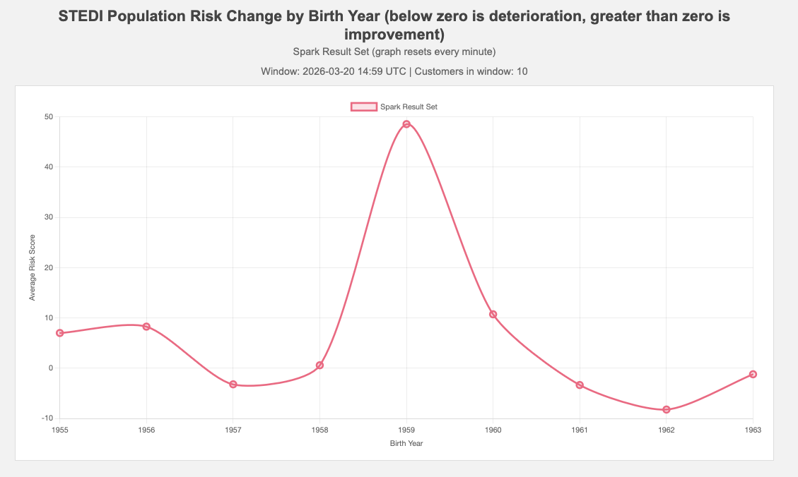

# STEDI Human Balance Evaluation with Apache Spark Streaming

A real-time data pipeline built with **Apache Spark Structured Streaming**, **Apache Kafka**, and **Redis** to evaluate fall-risk scores for STEDI customers.

---

## Architecture

```
Redis + STEDI simulator --> redis-server topic  --|
                                                  |--> Spark Join (on email) --> customer-risk topic --> Graph UI (localhost:3000)
STEDI simulator ----------> stedi-events topic ---|
```

---

## Prerequisites

- **Docker Desktop** 4.x (allocate at least **6 GB RAM** and **2 CPU cores**)
- **Docker Compose** 2.x (bundled with Docker Desktop)

---

## Step 1 -- Start All Services

```bash
docker compose down -v
docker compose up --build -d
```

Wait ~1 minute, then verify:

```bash
docker compose ps
```

All 10 services should show `Up`. `stedi-kafka-init` exits after creating topics (this is normal).

---

## Step 2 -- Verify Services Are Healthy

```bash
# STEDI simulator is producing data
docker logs --tail 5 stedi-app

# Spark worker registered with master
docker logs --tail 5 stedi-spark-worker

# All Kafka topics exist
docker exec stedi-kafka rpk topic list --brokers kafka:19092
```

Expected topics: `redis-server`, `stedi-events`, `customer-risk`, `rapid-step-risk`, `bank-transactions`, `trucking-data`.

Confirm data is flowing into Kafka:

```bash
docker exec stedi-kafka rpk topic consume redis-server --brokers kafka:19092 -n 1 --format '%v'
docker exec stedi-kafka rpk topic consume stedi-events --brokers kafka:19092 -n 1 --format '%v'
```

---

## Step 3 -- Run Spark Streaming Jobs

Run **one job at a time** on the single-worker cluster. All submit scripts run inside the Spark master container.

> If a job reports `Initial job has not accepted any resources`, restart Spark first:
> ```bash
> docker compose restart spark-master spark-worker
> ```

### Job 1 -- Validate Redis Stream (email + birth year)

```bash
docker exec -it stedi-spark-master /home/workspace/submit-redis-kafka-streaming.sh
```

Stop with `Ctrl+C` after the first batch appears (~10-20 seconds). Expected output:

```
+--------------------+---------+
|email               |birthYear|
+--------------------+---------+
|Gail.Spencer@test...|1963     |
|Craig.Lincoln@tes...|1962     |
+--------------------+---------+
```

### Job 2 -- Validate STEDI Events Stream (customer + score)

```bash
docker compose restart spark-master spark-worker
docker exec -it stedi-spark-master /home/workspace/submit-event-kafkastreaming.sh
```

Stop with `Ctrl+C` after rows appear. Expected output:

```
+--------------------+-----+
|customer            |score|
+--------------------+-----+
|Spencer.Davis@tes...| 8.0 |
+--------------------+-----+
```

### Job 3 -- Main Join (publishes to customer-risk topic)

```bash
docker compose restart spark-master spark-worker
docker exec stedi-spark-master rm -rf /tmp/kafkajoin-checkpoint /tmp/kafkajoin-console-checkpoint
sleep 3
docker exec -it stedi-spark-master /home/workspace/submit-event-kafkajoin.sh
```

Let it run for 30-60 seconds. In a **second terminal**, verify the output:

```bash
docker exec stedi-kafka rpk topic consume customer-risk --brokers kafka:19092 -n 5 --format '%v\n'
```

Expected output:

```json
{"customer":"Gail.Spencer@test.com","score":3.06,"email":"Gail.Spencer@test.com","birthYear":"1963"}
```

Open [http://localhost:3000](http://localhost:3000) -- the graph should show risk data by birth year.

### Job 4 -- Rapid Step Risk Score (optional standout)

```bash
docker compose restart spark-master spark-worker
docker exec stedi-spark-master rm -rf /tmp/rapid-step-risk-checkpoint
sleep 3
docker exec -it stedi-spark-master /home/workspace/submit-rapid-step-risk.sh
```

---
### STEDI Application UI 



## Stop All Services

```bash
docker compose down -v
```
